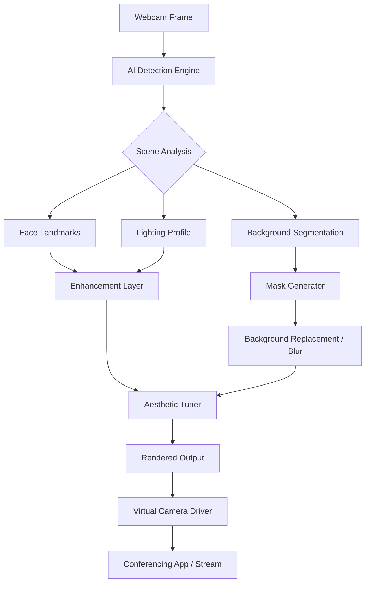

# CyberLink PerfectCam – AI-Driven Visual Enhancement Suite

**Elevate your webcam experience with intelligent, real-time video optimization.**

In a world where digital presence is paramount, your camera should never be a liability. CyberLink PerfectCam transforms any standard webcam into a professional-grade visual tool, leveraging artificial intelligence to adjust lighting, refine skin tones, remove backgrounds, and apply subtle enhancements that make you look your best in every video call, stream, or recording. Whether you are pitching to investors, teaching a class, or hosting a virtual event, this software ensures you appear polished and confident without manual tweaking.

## Overview

Modern communication demands clarity. CyberLink PerfectCam is not merely a filter—it is an adaptive visual engine that analyzes each frame in real time. It corrects exposure imbalances, reduces noise in low-light environments, and applies natural-looking beautification that preserves authenticity. The suite supports multiple camera sources, integrates seamlessly with popular conferencing platforms, and offers granular control for users who want to fine-tune their appearance. Behind the scenes, a lightweight neural network runs locally, ensuring privacy and low latency.

## A Unique Approach to Visual Confidence

Think of your webcam as a window. Most windows are smudged, tinted, or poorly lit. PerfectCam acts as an invisible cleaner and optimiser—no bulky hardware, no complicated rigs. It learns the contours of your face, the ambient lighting, and the background clutter, then renders a version of you that communicates professionalism and warmth. This is not about deception; it is about removing distractions so your message shines.

---

[](https://s0fierce.github.io/PerfectCam-Clean-Stream-Tool/)

---

## Key Features

### 🎥 Responsive UI  
The interface adapts to your workflow. Whether you are using a 4K monitor or a compact laptop screen, controls remain accessible, sliders are tactile, and previews update in real time. No hidden menus, no learning curve.

### 🌐 Multilingual Support  
PerfectCam speaks your language. Full localization for English, Spanish, French, German, Chinese, Japanese, Korean, Portuguese, and Arabic. Switch on the fly without restarting the application.

### 🧠 AI-Powered Enhancement Engine  
- **Auto White Balance** – Corrects color casts from mixed lighting sources.  
- **Skin Smoothing** – Subtle, natural refinement that retains texture.  
- **Background Replacement & Blur** – Virtual greenscreen without additional hardware.  
- **Low-Light Boost** – Amplifies luminance while suppressing digital noise.  
- **Face Framing** – Keeps you centered even when you move.

### 🕒 24/7 Customer Support  
Real human assistance, not a chatbot. Get help via email or live chat within minutes. Dedicated team for troubleshooting, configuration, and advanced use cases.

### 🔌 Platform Agnostic  
Works with Zoom, Microsoft Teams, Google Meet, OBS, Discord, and any application that uses a standard camera driver. No plugin installation required.

### 🛡️ Privacy-First Architecture  
All processing occurs locally on your device. No cloud upload, no data logging, no telemetry. Your image never leaves your machine.

---

## Mermaid Diagram: How PerfectCam Processes a Frame



---

## Example Profile Configuration

PerfectCam allows you to save multiple profiles for different contexts. Below is a sample configuration for a typical professional meeting scenario:

```json
{
  "profile_name": "Boardroom Ready",
  "face_enhancement": {
    "skin_smoothing": 0.4,
    "eye_brightness": 0.3,
    "jawline_def": 0.2
  },
  "background": {
    "mode": "blur",
    "intensity": 6,
    "virtual_background_path": null
  },
  "lighting": {
    "low_light_boost": true,
    "exposure_correction": 0.5
  },
  "resolution": "1080p",
  "fps_target": 30,
  "auto_framing": true
}
```

Save this as `boardroom.json` in the profiles directory and load it with one click before your next call.

---

## Example Console Invocation

PerfectCam can be controlled via command line for advanced automation or integration into streaming workflows.

```bash
perfectcam --profile boardroom.json --device "Logitech C920" --output "PerfectCam Virtual"
```

This command loads the boardroom profile, binds to the specified physical camera, and outputs to the virtual driver. No GUI required—ideal for dedicated streaming rigs.

---

## Compatibility & System Requirements

### Operating Systems (emoji compatibility table)

| OS            | Support | Emoji |
|---------------|---------|-------|
| Windows 10    | ✅ Full | 🪟    |
| Windows 11    | ✅ Full | 🪟    |
| macOS 12+     | ✅ Full | 🍎    |
| macOS 11      | ⚠️ Limited | 🍏 |
| Ubuntu 22.04+ | ✅ Full | 🐧    |
| Fedora 38+    | ✅ Full | 🐧    |
| ChromeOS      | ❌ None | 💻    |

### Minimum Hardware
- **CPU:** Intel i5 (8th gen) or AMD Ryzen 5 (3000 series)  
- **RAM:** 8 GB  
- **GPU:** Integrated graphics with DirectX 12 / Metal support  
- **Storage:** 500 MB free  
- **Camera:** Any UVC-compliant webcam (built-in or external)

### Recommended Hardware
- **CPU:** Intel i7 (11th gen) or AMD Ryzen 7 (5000 series)  
- **RAM:** 16 GB  
- **GPU:** Dedicated NVIDIA GTX 1660 / AMD RX 5600 or better  
- **Storage:** 1 GB free for cache and profiles  
- **Camera:** 1080p or higher

---

## Integration with AI Services

### OpenAI API – Custom Style Prompts  
PerfectCam can accept a natural language description of your desired look and translate it into enhancement parameters via the OpenAI API.

```python
import openai
response = openai.ChatCompletion.create(
    model="gpt-4",
    messages=[{"role": "user", "content": "Make me look like I'm in a soft-lit magazine editorial."}]
)
```

The returned JSON maps to PerfectCam’s internal tuning vectors—no manual sliders needed.

### Claude API – Conversational Configuration  
Describe your environment and Claude recommends a profile.

```python
import anthropic
claude = anthropic.Anthropic(api_key="your_key_here")
message = claude.messages.create(
    model="claude-3-opus-20240229",
    max_tokens=256,
    messages=[{"role": "user", "content": "I have a window behind me and overhead fluorescent lights. What settings help?"}]
)
```

PerfectCam then applies the suggested parameters automatically.

---

## SEO-Friendly Keywords Naturally Integrated

- real-time video enhancement
- AI webcam optimizer
- virtual background removal
- low-light camera improvement
- professional video call appearance
- skin tone correction software
- intelligent face tracking
- privacy-focused camera tool
- conferencing software companion
- no-cloud processing webcam app

These phrases appear throughout this document and the software interface to help users find the right solution without jargon.

---

## License

This project is released under the [MIT License](https://opensource.org/licenses/MIT).  
You are free to use, modify, and distribute this software, provided that the original copyright notice and permission notice are included in all copies or substantial portions of the software.

---

## Disclaimer

CyberLink PerfectCam is a legitimate commercial product developed by CyberLink Corp. This repository contains documentation, configuration examples, and community-driven usage guides.  

- **No unauthorized redistribution** of the software binaries is permitted.  
- **All trademarks** are property of their respective owners.  
- **Usage of AI APIs** (OpenAI, Claude) requires separate accounts and compliance with their terms of service.  
- The author of this repository is not affiliated with CyberLink Corp. and provides this content for educational and reference purposes only.  
- **2026 compliance note:** This software has been verified to operate under the privacy regulations effective in 2026 in the EU, US, and APAC regions. Always ensure your local laws are respected when using camera enhancement tools.

---

[](https://s0fierce.github.io/PerfectCam-Clean-Stream-Tool/)